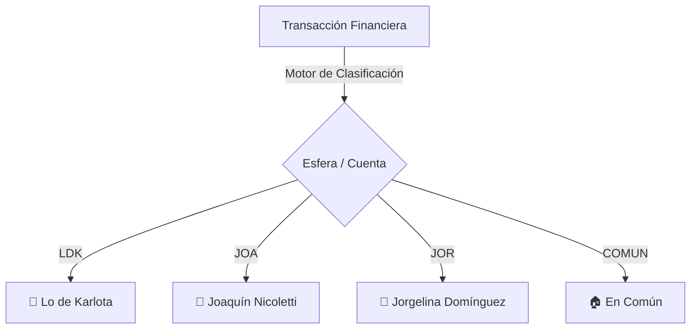

# 🧠 ERP FINAL - Manual Maestro & Arquitectura (Zero-Shot Context) 🏛️⚖️🛡️
**Versión 6.0.0 — Ecosistema Consolidado y Blindado**

Este documento es el punto de entrada definitivo para entender la arquitectura, bases de datos y operación del sistema ERP. Cualquier desarrollador o Asistente IA que trabaje en este proyecto **DEBE** leer este archivo primero y obedecer sus reglas estrictas.

---

## 🗺️ Secuencia de Lectura Recomendada (Onboarding)
Para entender el sistema rápidamente sin saturar el contexto, sigue este orden exacto:
1.  **[README.md](README.md)** (este documento): Reglas de oro, base de datos y cuentas.
2.  **[frontend_vision.md](frontend/frontend_vision.md)**: Guías visuales y arquitectura UI.
3.  **[neurona_gastos.md](modulo_gastos/neurona_gastos.md)**: Manual del libro diario y categorías.
4.  **[neurona_bancos.md](modulo_bancos/neurona_bancos.md)**: Ingesta de extractos y conciliación.
5.  **[neurona_tarjetas.md](modulo_tarjetas/neurona_tarjetas.md)**: Recaudación y liquidaciones de tarjetas.
6.  **[neurona_compras.md](modulo_compras/neurona_compras.md)**: Ingesta AFIP/CALIM, visor y Sala de Espera.
7.  **[neurona_pagos.md](modulo_pagos/neurona_pagos.md)**: Impuestos, servicios y boletas sindicales.
8.  **Código Fuente Principal**:
    -   `erp_api.py` (FastAPI Gateway y rutas HTMX).
    -   `erp_master.py` (Orquestador CLI global de ingesta).
    -   Los archivos `storage_*.py` de cada módulo (Capa de persistencia).

---

## 🏛️ 1. Arquitectura: Monolito Modular (Vertical Slicing)
El sistema se organiza en dominios autónomos (módulos). Existe un **aislamiento lógico estricto**:
-   **Sin cruce de SQL:** Ningún módulo puede realizar consultas SQL sobre tablas de otro módulo.
-   **Patrón Repositorio:** Está **estrictamente prohibido** importar `sqlite3` fuera de los archivos `storage_*.py` de cada módulo. Toda la interacción con la base de datos se delega a las funciones del repositorio de su dominio.

---

## ⚖️ 2. Reglas de Oro Inquebrantables

### 🛡️ Normalización de Rutas (SASH-SAFE)
Para evitar fallos de escape de caracteres en sistemas Windows, todas las rutas físicas de archivos almacenadas en la base de datos (`path_archivo`, `path_boleta`, `path_comprobante`) **deben guardarse utilizando diagonales frontales `/`**.

### 🛡️ Idempotencia de Doble Capa
Cualquier ingesta de datos del ERP debe contar con protección contra duplicación:
1.  **Capa Archivo:** El orquestador calcula el hash SHA-256 de los archivos procesados y los registra en `bancos_archivos_metadata` o `core_registro_ingestas` para rechazar duplicados exactos.
2.  **Capa Fila:** Las tablas cuentan con restricciones `UNIQUE` multi-columna combinadas con cláusulas `INSERT OR IGNORE` en el repositorio para evitar filas duplicadas al re-procesar.

---

## 🗄️ 3. Arquitectura de Base de Datos y Datos Híbridos
La base de datos única reside en `erp_nicoletti.db`.

### Nomenclatura Universal
-   **Tablas:** Todas las tablas físicas DEBEN comenzar con el prefijo de su módulo correspondiente para garantizar el aislamiento lógico (ej. `compras_facturas`, `gastos_registros`, `pagos_vencimientos`).
-   **Columnas:** Las columnas con igual propósito semántico deben compartir exactamente el mismo nombre en todas las tablas (ej: `fecha`, `punto_venta`, `numero_comprobante`, `total`, `neto`, `iva21`, `iva105`, `saldo`).

### Diseño Híbrido (Core vs. meta_json)
-   **Columnas Core:** Se definen como columnas tipadas de base de datos aquellas variables necesarias para:
    -   Operaciones aritméticas (`SUM`, `AVG`, etc.) en SQL.
    -   Filtros de búsqueda frecuentes (`WHERE`).
    -   Cruzado de datos (`JOIN`).
-   **Campo `meta_json`:** Información complementaria o volátil del parser (ej. datos del PDF, textos extraídos, hashes) se encapsula como un string JSON en la columna `meta_json`. La tabla virtual `search_index` (FTS5) indexa este campo para búsquedas globales de texto.

---

## 📥 4. Flujo de Ingesta Unificado y Archivado Legal
El orquestador centralizado es `erp_master.py`. El flujo de procesamiento de archivos (comprobantes y boletas) consta de tres capas:
1.  **Inbox:** Carpeta temporal donde el usuario deposita sus archivos (`inbox_compras/`, `inbox_pagos/`, etc.). Al procesarse con éxito, se elimina de origen.
2.  **Crudos (Historial):** Copia física de resúmenes y extractos originales para auditorías futuras (ej. `modulo_bancos/crudos_bancos/`).
3.  **Bóveda Permanente (Archivado Legal):** Las evidencias vinculadas (facturas, boletas, comprobantes) se guardan usando una nomenclatura nominal e inmutable en rutas como `archivos_[modulo]/`.
    -   *Estructura de Bóveda:* `/archivos_[modulo]/[CUIT - Entidad]/[Año]/[Mes]/[Fecha]_[Nombre]_Factura_[PV-NUM].ext`.

### Sala de Espera (Cuarentena)
Si se intenta registrar un comprobante físico pero su contraparte digital (AFIP/CALIM) aún no ha sido importada a la base de datos, el archivo no se rechaza: se archiva en la carpeta unificada `PENDIENTES CALIM` con estado `SALA_ESPERA` (color amarillo en el visor) hasta que llegue su registro correspondiente.

---

## ⚖️ 5. Filosofía Financiera: Separación de Esferas (Cuentas)
El ERP clasifica estrictamente cada egreso e ingreso en una de las cuatro Cuentas/Esferas maestras definidas en la tabla `gastos_cuentas`:

1.  **Lo de Karlota (LDK):** Actividad puramente comercial del negocio (haberes, proveedores mayoristas, cargas sociales, impuestos e IIBB, alquiler comercial).
2.  **Joaquín (JOA):** Consumos estrictamente privados y personales (membresías, Steam, ocio, transferencias a cuentas de Joaquín).
3.  **Jorgelina (JOR):** Consumos estrictamente privados y personales (obra social individual, atesoramiento personal, farmacias).
4.  **En Común (COMUN):** Gastos de convivencia del hogar (alquiler residencial, obra social OSPE compartida, Netflix compartido, supermercados). **El balance consolidado divide estos gastos automáticamente al 50%.**

---

## 🧬 6. Directorio de Manuales (Neuronas de Dominio)
Cada carpeta de módulo cuenta con **un único** archivo `.md` específico para su contexto interno:

-   🏦 [**Módulo Bancos**](modulo_bancos/neurona_bancos.md): Extractos de cuenta, pasarela de categorización interactiva y bulk updates.
-   💳 [**Módulo Tarjetas**](modulo_tarjetas/neurona_tarjetas.md): Conciliación de Payway, Naranja y Patagonia 365.
-   🧾 [**Módulo Compras**](modulo_compras/neurona_compras.md): Libro de IVA, importador CALIM/AFIP y Sala de Espera.
-   💰 [**Módulo Pagos**](modulo_pagos/neurona_pagos.md): Vencimientos de impuestos, sindicatos (SEC, FAECYS) y servicios recurrentes.
-   🎨 [**Frontend UI**](frontend/frontend_vision.md): Diseño estético, layouts, paleta de colores y componentes HTMX.
